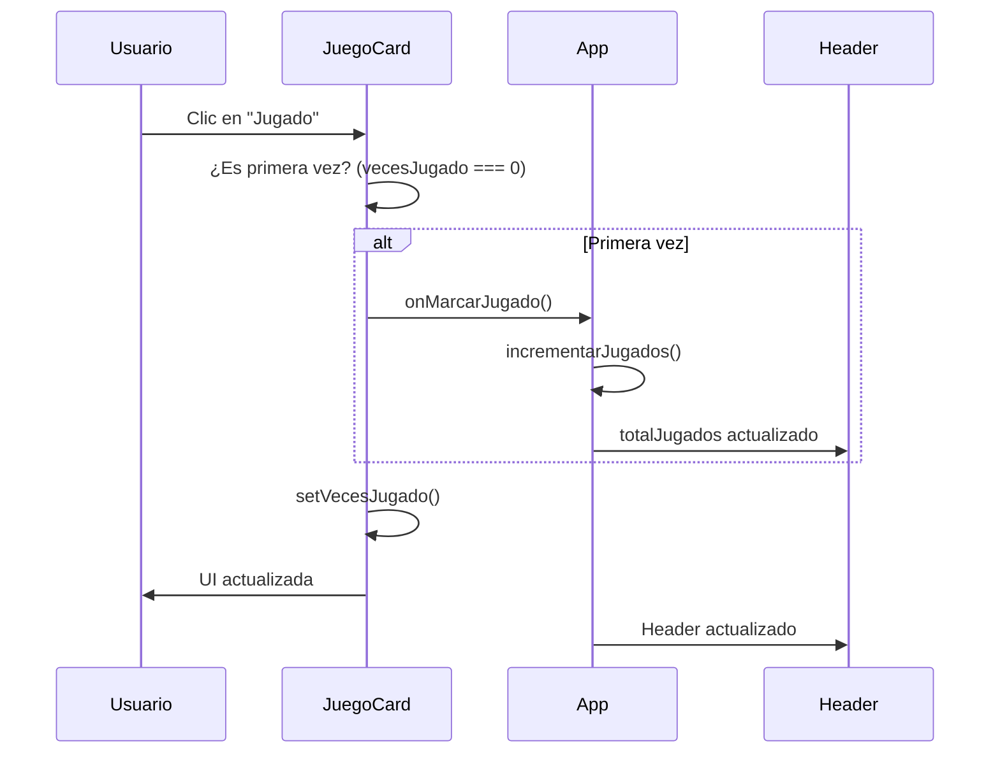

# Proceso de Arreglo de React - De Errores a Solución Funcional

## Introducción

Este documento documenta el proceso completo de identificación y corrección de errores en una aplicación React de colección de videojuegos. Partimos de una aplicación con múltiples errores fundamentales y llegamos a una solución funcional aplicando los principios básicos de React.

## Estado Inicial: Aplicación con Errores

La aplicación original tenía estos problemas visibles:
- El Header mostraba números fijos ("6" y "0")
- El formulario no permitía agregar juegos
- Los botones "Jugado" no mostraban el contador en la UI
- No había comunicación entre componentes

## Análisis de Errores y Soluciones

---

### ❌ ERROR 1: Header con Datos Hardcodeados

#### Problema
El componente Header mostraba valores estáticos en lugar de datos dinámicos.

#### Código Original con Error
```javascript
const Header = ({ titulo }) => {
  return (
    <div className="bg-white p-5 rounded-lg mb-5 text-center">
      <h1 className="text-purple-800 mb-2 text-3xl font-bold">{titulo}</h1>
      <p className="text-gray-700">Gestiona tu colección de videojuegos</p>
      
      <div className="bg-purple-100 p-4 rounded mt-4 flex justify-around">
        <div className="text-center">
          <strong className="block text-2xl text-purple-500">6</strong> {/* ❌ HARDCODEADO */}
          <span className="text-gray-700">Total Juegos</span>
        </div>
        <div className="text-center">
          <strong className="block text-2xl text-purple-500">0</strong> {/* ❌ HARDCODEADO */}
          <span className="text-gray-700">Jugados</span>
        </div>
      </div>
    </div>
  );
};
```

#### ¿Por qué ocurre este error?
- **Violación del principio de datos dinámicos**: React está diseñado para mostrar datos que cambian
- **Falta de props**: El componente no recibía los datos que necesitaba mostrar
- **Acoplamiento**: Los valores estaban fijos en el componente en lugar de venir del estado

#### Fundamento React Aplicado: **Props y Flujo de Datos**
En React, los datos deben fluir de padres a hijos mediante props. Los componentes deben ser reutilizables y mostrar datos dinámicos.

#### Solución Implementada
```javascript
const Header = ({ titulo, totalJuegos, totalJugados }) => {
  return (
    <div className="bg-white p-5 rounded-lg mb-5 text-center">
      <h1 className="text-purple-800 mb-2 text-3xl font-bold">{titulo}</h1>
      <p className="text-gray-700">Gestiona tu colección de videojuegos</p>
      
      <div className="bg-purple-100 p-4 rounded mt-4 flex justify-around">
        <div className="text-center">
          <strong className="block text-2xl text-purple-500">{totalJuegos}</strong>
          <span className="text-gray-700">Total Juegos</span>
        </div>
        <div className="text-center">
          <strong className="block text-2xl text-purple-500">{totalJugados}</strong>
          <span className="text-gray-700">Jugados</span>
        </div>
      </div>
    </div>
  );
};
```

#### Cambios Realizados
1. **Añadir parámetros**: `totalJuegos` y `totalJugados` como props
2. **Reemplazar valores fijos**: Usar las variables dinámicas
3. **Actualizar llamada en App**: Pasar los valores reales

---

### ❌ ERROR 2: Formulario sin Estado Controlado

#### Problema
El formulario usaba variables normales en lugar de estado de React, y los inputs no estaban conectados al estado.

#### Código Original con Error
```javascript
const FormularioJuego = ({ onAgregar }) => {
  const titulo = "";        // ❌ ERROR: Variable normal, no estado
  const desarrollo = "";    // ❌ ERROR: Variable normal, no estado
  const año = "";           // ❌ ERROR: Variable normal, no estado

  const handleSubmit = (e) => {
    e.preventDefault();
    
    if (titulo && desarrollo && año) { // ❌ Siempre será falso
      onAgregar({
        titulo,
        desarrollo,
        año: parseInt(año)
      });
    }
  };

  return (
    <div className="bg-white p-5 rounded-lg mb-5">
      <form onSubmit={handleSubmit}>
        <input 
          type="text"
          placeholder="Ej: Tetris"
          // ❌ FALTAN: value y onChange
        />
      </form>
    </div>
  );
};
```

#### ¿Por qué ocurre este error?
- **Confusión entre variables y estado**: Las variables normales no provocan re-renderizados
- **Inputs no controlados**: React no sabe qué contienen los inputs sin `value` y `onChange`
- **Validación imposible**: Las variables siempre están vacías, nunca se cumple la condición

#### Fundamento React Aplicado: **Componentes Controlados**
En React, los inputs deben estar "controlados" por el estado del componente. Esto permite que React sepa siempre qué valor tienen y pueda re-renderizar cuando cambian.

#### Solución Implementada
```javascript
const FormularioJuego = ({ onAgregar }) => {
  // ✅ CORRECTO: Usar useState para cada campo
  const [titulo, setTitulo] = useState('');
  const [desarrollo, setDesarrollo] = useState('');
  const [año, setAño] = useState('');

  const handleSubmit = (e) => {
    e.preventDefault();
    
    if (titulo && desarrollo && año) { // ✅ Ahora funciona
      onAgregar({
        titulo,
        desarrollo,
        año: parseInt(año)
      });
      // ✅ Limpiar el formulario después de enviar
      setTitulo('');
      setDesarrollo('');
      setAño('');
    }
  };

  return (
    <div className="bg-white p-5 rounded-lg mb-5">
      <form onSubmit={handleSubmit}>
        <input 
          type="text"
          value={titulo} // ✅ Conectar con el estado
          onChange={(e) => setTitulo(e.target.value)} // ✅ Actualizar estado
          placeholder="Ej: Tetris"
        />
      </form>
    </div>
  );
};
```

#### Cambios Realizados
1. **Reemplazar variables por estado**: Usar `useState` para cada campo
2. **Conectar inputs**: Agregar `value` y `onChange` a todos los inputs
3. **Limpiar formulario**: Resetear el estado después de enviar

---

### ❌ ERROR 3: Variable Normal en JuegoCard (No Reactiva)

#### Problema
Se usaba una variable normal para el contador, que no se actualizaba en la interfaz.

#### Código Original con Error
```javascript
const JuegoCard = ({ titulo, desarrollo, año }) => {
  let vecesJugado = 0; // ❌ ERROR: Variable normal, no estado

  const marcarComoJugado = () => {
    vecesJugado = vecesJugado + 1; // ❌ ERROR: Modificando variable normal
    console.log("Jugado:", vecesJugado); // Solo se ve en consola
  };

  return (
    <div className="bg-white rounded-lg p-5 flex-1 min-w-[280px]">
      <button onClick={marcarComoJugado}>
        Jugado <span className="font-bold ml-1">({vecesJugado})</span> {/* ❌ Siempre mostrará 0 */}
      </button>
    </div>
  );
};
```

#### ¿Por qué ocurre este error?
- **Malentendido del estado**: Las variables normales no provocan re-renderizados en React
- **Inmutabilidad**: React necesita saber cuándo cambia el estado para volver a dibujar
- **Ciclo de vida**: Las variables normales se reinician en cada renderizado

#### Fundamento React Aplicado: **Estado y Re-renderizado**
React solo vuelve a renderizar un componente cuando su estado cambia mediante las funciones setter (`setState`). Las variables normales no activan este mecanismo.

#### Solución Implementada
```javascript
const JuegoCard = ({ titulo, desarrollo, año, onMarcarJugado }) => {
  // ✅ CORRECTO: Usar estado local para el contador visual
  const [vecesJugado, setVecesJugado] = useState(0);

  const marcarComoJugado = () => {
    // ✅ Si es la primera vez que se juega este juego, avisa al padre
    if (vecesJugado === 0) {
      onMarcarJugado(); //llama a la funcion del padre
    }
    
    setVecesJugado(vecesJugado + 1); // ✅ Actualizar estado local
    console.log("Jugado:", vecesJugado);
  };

  return (
    <div className="bg-white rounded-lg p-5 flex-1 min-w-[280px]">
      <button onClick={marcarComoJugado}>
        Jugado <span className="font-bold ml-1">({vecesJugado})</span> {/* ✅ Ahora muestra el valor real */}
      </button>
    </div>
  );
};
```

#### Cambios Realizados
1. **Reemplazar variable por estado**: `useState(0)` para el contador
2. **Usar setter**: `setVecesJugado()` para actualizar el valor
3. **Activar re-renderizado**: React ahora detecta los cambios y actualiza la UI

---

### ❌ ERROR 4: Sin Comunicación entre Componentes

#### Problema
No había comunicación entre JuegoCard y App para actualizar el contador global de juegos jugados.

#### Código Original con Error
```javascript
// En App:
<JuegoCard
  titulo={juego.titulo}
  desarrollo={juego.desarrollo}
  año={juego.año}
  // ❌ FALTAN: onMarcarJugado
/>

// En JuegoCard:
const JuegoCard = ({ titulo, desarrollo, año }) => { // ❌ FALTA: onMarcarJugado
  const marcarComoJugado = () => {
    onMarcarJugado(); // ❌ ERROR: onMarcarJugado no existe
  };
}
```

#### ¿Por qué ocurre este error?
- **Falta de props**: El hijo no recibía la función del padre
- **Encapsulamiento**: Los componentes no pueden acceder directamente a funciones de otros componentes
- **Flujo de datos**: No se seguía el patrón de eventos hacia arriba

#### Fundamento React Aplicado: **Comunicación Padre-Hijo**
En React, la comunicación se realiza mediante props:
- **Datos hacia abajo**: Padre → Hijo (props)
- **Eventos hacia arriba**: Hijo → Padre (funciones como props)

#### Solución Implementada
```javascript
// En App:
const incrementarJugados = () => {
  setTotalJugados(totalJugados + 1);
};

<JuegoCard
  titulo={juego.titulo}
  desarrollo={juego.desarrollo}
  año={juego.año}
  onMarcarJugado={incrementarJugados} // ✅ Pasar la función como prop
/>

// En JuegoCard:
const JuegoCard = ({ titulo, desarrollo, año, onMarcarJugado }) => { // ✅ Recibir la función
  const marcarComoJugado = () => {
    if (vecesJugado === 0) {
      onMarcarJugado(); // ✅ Llamar a la función del padre
    }
    setVecesJugado(vecesJugado + 1);
  };
}
```

#### Cambios Realizados
1. **Añadir parámetro**: `onMarcarJugado` en JuegoCard
2. **Pasar función**: `incrementarJugados` como prop desde App
3. **Lógica condicional**: Solo notificar al padre la primera vez

---

## Flujo Completo de la Aplicación Funcional

### 1. Estado Inicial
```javascript
const App = () => {
  const [juegos, setJuegos] = useState([
    { id: 1, titulo: "Pac-Man", desarrollo: "Namco", año: 1980 },
    // ... otros juegos
  ]);

  const [totalJugados, setTotalJugados] = useState(0);
```

### 2. Flujo de Usuario: Marcar Juego como Jugado



### 3. Código Final del Flujo

```javascript
// App.js
const App = () => {
  const [juegos, setJuegos] = useState(/* juegos iniciales */);
  const [totalJugados, setTotalJugados] = useState(0);

  const incrementarJugados = () => {
    setTotalJugados(totalJugados + 1);
  };

  return (
    <div>
      <Header 
        titulo="Mi Colección de Videojuegos Arcade"
        totalJuegos={juegos.length}
        totalJugados={totalJugados}
      />
      
      <div className="flex flex-wrap gap-5">
        {juegos.map(juego => (
          <JuegoCard
            key={juego.id}
            titulo={juego.titulo}
            desarrollo={juego.desarrollo}
            año={juego.año}
            onMarcarJugado={incrementarJugados}
          />
        ))}
      </div>
    </div>
  );
};

// JuegoCard.js
const JuegoCard = ({ titulo, desarrollo, año, onMarcarJugado }) => {
  const [vecesJugado, setVecesJugado] = useState(0);

  const marcarComoJugado = () => {
    if (vecesJugado === 0) {
      onMarcarJugado(); // Notificar al padre
    }
    setVecesJugado(vecesJugado + 1); // Actualizar estado local
  };

  return (
    <div>
      <h3>{titulo}</h3>
      <button onClick={marcarComoJugado}>
        Jugado ({vecesJugado})
      </button>
    </div>
  );
};
```

## Principios React Aprendidos

### 1. **Estado (State)**
- El estado es la memoria de un componente
- Solo el estado provoca re-renderizados
- Usar `useState` para manejar el estado local

### 2. **Props**
- Las props son datos inmutables que pasan de padre a hijo
- Permiten la comunicación unidireccional
- Las funciones también pueden pasarse como props

### 3. **Componentes Controlados**
- Los inputs deben estar conectados al estado
- `value` muestra el valor actual
- `onChange` actualiza el estado

### 4. **Flujo de Datos Unidireccional**
- Datos: Padre → Hijo (props)
- Eventos: Hijo → Padre (funciones como props)

### 5. **Re-renderizado**
- React solo vuelve a dibujar cuando el estado cambia
- Usar siempre las funciones setter, nunca asignación directa

## Resumen de la Solución

| Error | Causa Raíz | Solución | Principio React |
|-------|------------|----------|-----------------|
| Header hardcodeado | Datos estáticos | Props dinámicas | Flujo de datos |
| Formulario sin estado | Variables normales | useState + inputs controlados | Componentes controlados |
| Contador no reactivo | Variable normal | useState local | Estado y re-renderizado |
| Sin comunicación | Falta de props | Pasar funciones como props | Comunicación padre-hijo |

## Conclusión

El proceso de arreglo de esta aplicación demuestra la importancia de seguir los principios fundamentales de React:

1. **Todo lo que cambia debe estar en el estado**
2. **Los datos fluyen hacia abajo, los eventos hacia arriba**
3. **Los componentes deben ser controlados y predecibles**
4. **La comunicación entre componentes se realiza mediante props**

La aplicación final es completamente funcional, mantenible y sigue las mejores prácticas de React. Cada error fue una oportunidad para entender mejor cómo funciona React y por qué sus patrones son importantes.
